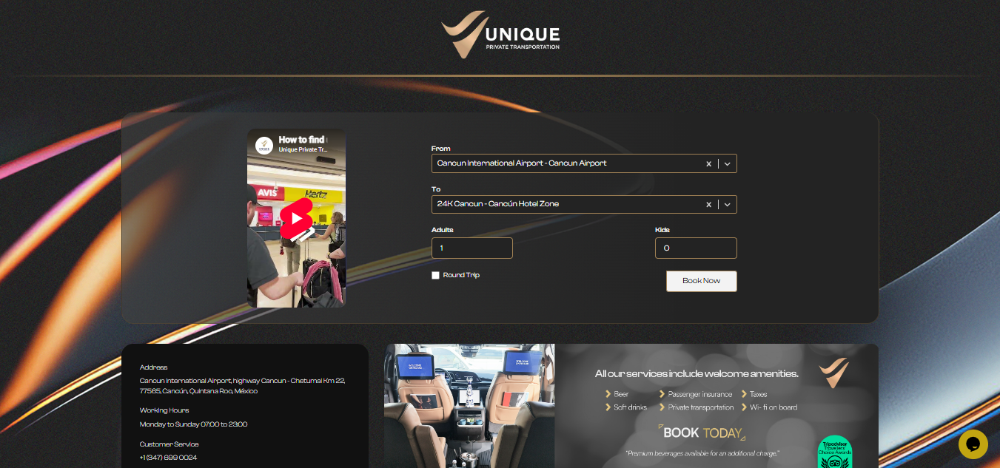

# 👩‍💻 Karla Díaz | Software Developer

Desarrolladora de software con experiencia en frontend, backend y testing, enfocada en construir aplicaciones eficientes, escalables y con buena experiencia de usuario.

---

## 🚀 Sobre mí

- 💻 Experiencia en desarrollo web y móvil  
- ⚙️ Experiencia en frontend, backend y QA testing  
- 🧪 Enfoque en calidad de software (Cypress, k6)  
- 📱  Desarrollo de aplicaciones web y mobile  
- 🎯 Enfoque en rendimiento, UX y buenas prácticas  

---

## 🛠 Tecnologías

- **Frontend:** React, Vue, Angular, React Native, Astro  
- **Backend:** .NET, Laravel, PHP, Node.js  
- **Bases de datos:** SQL Server, MySQL  
- **Testing:** Cypress, k6  
- **UI:** Material UI, Tailwind, Bootstrap  
- **Otros:** Git, GitHub, GitLab, HubSpot  

---

## 💼 Experiencia

**Desarrolladora Fullstack | Devtzal**
- Desarrollo de aplicaciones web con Astro, Laravel y MySQL  
- Implementación de interfaces con Vue y React Native  
- Mantenimiento y evolución de sistemas existentes  
- Pruebas de software para asegurar calidad  

**Desarrolladora Fullstack | Ozelot Technologies**
- Desarrollo de módulos para sistema de RRHH  
- Uso de .NET, Angular y SQL Server  
- Implementación de arquitectura Onion y MVC  
- Documentación de APIs  

**Frontend Developer & QA Tester | Marketing Dirigido**
- Desarrollo de interfaces responsivas  
- Testing manual y automatizado  
- Mejora de rendimiento y estabilidad del sistema  

---

## 📂 Proyectos

**🧹 Roomclean – Sistema de Gestión de Limpieza**
- Diseño de UI en Figma  
- Backend con .NET + Entity Framework  
- API REST documentada con Swagger  
- Frontend web con React  
- Aplicación para gestión de tareas operativas  

---

## 🌐 Proyectos en producción

### Sistema de reservaciones de transporte

Rediseño del sistema, optimizando la experiencia de usuario (UX/UI) y mejorando la lógica del frontend para incrementar rendimiento y mantenibilidad.

---

## 📜 Certificaciones

- CCNAv7: Introduction to Networks  
- Tester – Fundación Carlos Slim  

---

## 📫 Contacto

📧 [montsedays24@gmail.com](mailto:montsedays24@gmail.com)  
🔗 https://linkedin.com/in/KarlaDiazL
